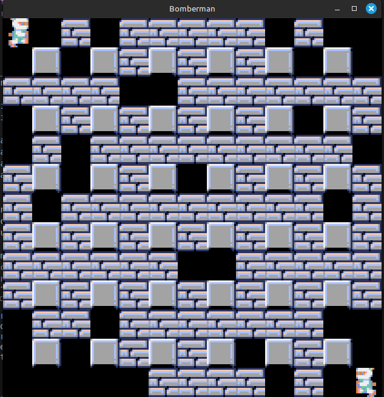

# Bomberman

Welcome to **Bomberman**, a game created with [Pyxel](https://github.com/kitao/pyxel).

## Summary

- [Preview](#aperçu)
- [Prerequisites](#prérequis)
- [Installation](#installation)
- [Usage](#utilisation)
- [Licence](#licence)

---

## Preview



Bomberman is a small retro game made with pyxel for NSI.

## Prerequisites

Before starting, you must have :
 - Python 3
 - pip installed on your OS
   
## Installation

   ```bash
   git clone https://github.com/votre_nom/projet-pyxel.git
   cd projet-pyxel
   ```

## Utilisation

  ```bash
  python main.py
  ```

## License

This project is under MIT LICENSE. Please see LICENSE for more information.
